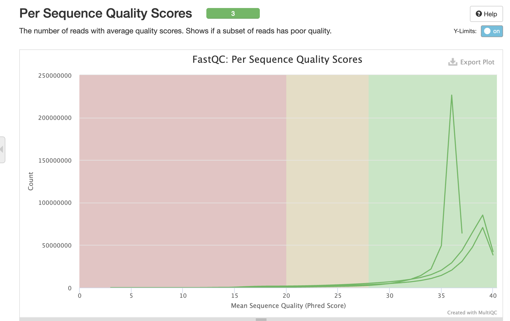
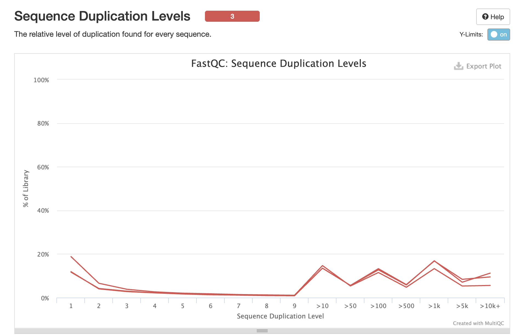
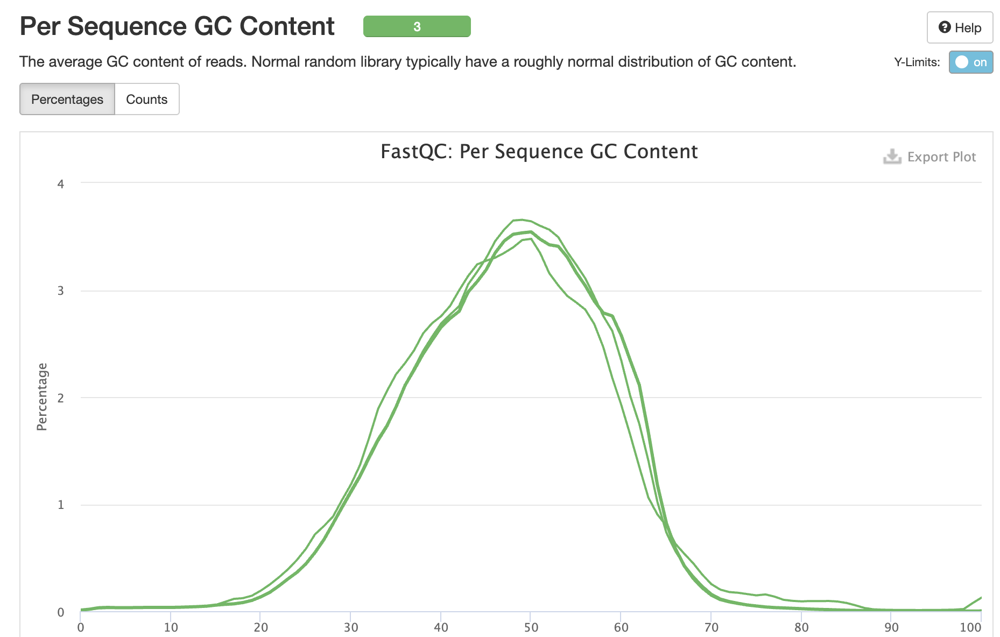

## Overview

Quality control analysis of raw FASTQ files from GSE256438 (Khouri-Farah et al., 2025) investigating Purkinje cell diversity in embryonic mouse cerebellum.

**Dataset:** - 3 samples: E16.5 (2 replicates), E18.5 - Technology: 10X Genomics Chromium - Sequencing: Illumina NextSeq 500

------------------------------------------------------------------------

## Methods

FASTQ files were downloaded from SRA using `fasterq-dump` and analyzed with FastQC v0.12.1. Results were aggregated using MultiQC v1.15.

------------------------------------------------------------------------

## Results

### General Statistics

| Sample                   | Total Reads | \% Duplicates | \% GC | Status  |
|--------------------------|-------------|---------------|-------|---------|
| SRR28065510 (E18.5)      | 378.4M      | 82.8%         | 47%   | ✅ Pass |
| SRR28065511 (E16.5 rep2) | 415.3M      | 73.8%         | 46%   | ✅ Pass |
| SRR28065512 (E16.5 rep1) | 286.2M      | 82.9%         | 47%   | ✅ Pass |

### Sequence Quality



**Interpretation:** All samples show high base quality (Phred \>30) across read positions, with expected slight degradation at read ends.

### Duplication Levels



**Interpretation:** High duplication rates (73-83%) are flagged but **EXPECTED** for scRNA-seq due to: - Low RNA input per cell - PCR amplification during library prep - UMI-based deduplication in Cell Ranger will address this

### GC Content



**Interpretation:** Normal GC distribution (\~47%) consistent across samples and appropriate for mouse genome.

------------------------------------------------------------------------

## Issues Encountered & Solutions

### Problem 1: Missing Technical Reads

**Issue:** Initial download using `fasterq-dump --split-files` only retrieved Read 2 (cDNA, 98bp). Barcode/UMI reads were discarded.

**Evidence:** Download logs showed:

```         
reads read: 858,686,424
reads written: 286,228,808  
technical reads: 572,457,616  # <- DISCARDED
```

**Solution:** Re-downloading with `--include-technical` flag to retain all reads required for Cell Ranger.

### Problem 2: High Duplication Rates

**Issue:** FastQC flagged 73-83% duplication as concerning.

**Solution:**  This is normal for scRNA-seq. Cell Ranger's UMI collapse will remove PCR duplicates during alignment.

------------------------------------------------------------------------

## Next Steps

1.  Complete re-download with all technical reads (barcodes + UMIs)
2.  Re-run FastQC on complete dataset (R1 + R2)
3.  Cell Ranger alignment to mm10 reference
4.  Seurat QC: filter cells by nFeature, nCount, percent.mt

------------------------------------------------------------------------

## Session Info

-   **FastQC:** v0.12.1
-   **MultiQC:** v1.15
-   **Date:** March 17, 2026

